# 3D Computer Vision: Homework
## Contents
#### [Project 1: Homography Estimation](#project-1-homography-estimation-1)
* keywords: ORB, RANSAC, normalized direct linear transformation (DLT) algorithm
#### [Project 2: Document Rectification](#project-2-document-rectification-1)
* keywords: normalized direct linear transformation (DLT) algorithm, inverse warping (bilinear interpolation), GUI mouse click
#### [Project 3: Stereo Rectification](#project-3-stereo-rectification-1)
* keywords: epipolar geometry, stereo processing
#### [Project 4: Image Stitching](#project-4-image-stitching-1)
* keywords: image stitching, image warping
#### [Project 5: 3D Rasterizer](#project-5-3d-rasterizer-1)
* keywords: rasterization, mesh, pygame
#### [Project 6: Camera Pose Estimation](#project-6-camera-pose-estimation-1)
* keywords: Perspective-n-Point (PnP) pose computation, DLT, EPnP, RANSAC, trajectory, augmented reality (AR)
#### [Project 7: Camera Calibration](#project-7-camera-calibration-1)
* keywords: chessboard, camera intrinsic matrix, distortion coefficients, RMS reprojection error
#### [Project 8: Visual Odometry](#project-8-visual-odometry-1)
* keywords: camera relative pose, epipolar geometry, triangulation, absolute orientation problem
#### [Final Project: SAD-SLAM](https://github.com/MartyJan/SAD-SLAM)
* keywords: NICE-SLAM, SA-ConvONet, Mask R-CNN
* external link: [github](https://github.com/MartyJan/SAD-SLAM), [report](https://github.com/MartyJan/SAD-SLAM/blob/main/report.pdf), [video](https://youtu.be/dVUWtoyijMk)
#### Note
* Some [notes and references](#note-1) are listed at the bottom of this page. 

---
# Project 1: Homography Estimation
#### Python Usage
```
python3 HomographyEstimation.py --img1 images/1-b0.jpg --img2 images/1-b1.jpg --n 4 --descriptor o
```
#### Original images: 


#### Find the keypoints using ORB:
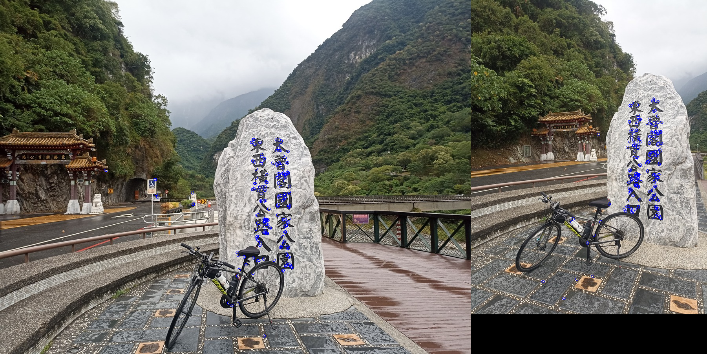

#### Brute-force Matching:
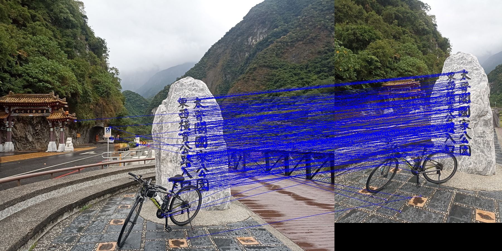

#### Find inliers using the homography matrix:
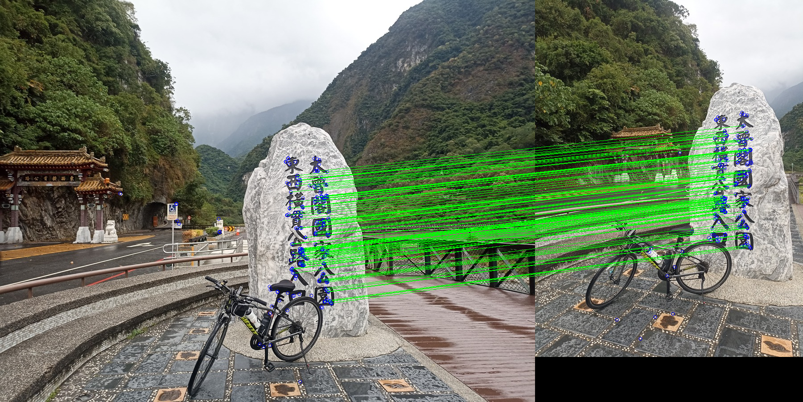

---

# Project 2: Document Rectification
#### Python Usage
```
python3 DocumentRectification.py --img1 images/book1.jpg 
```

#### The original book and its rectification:
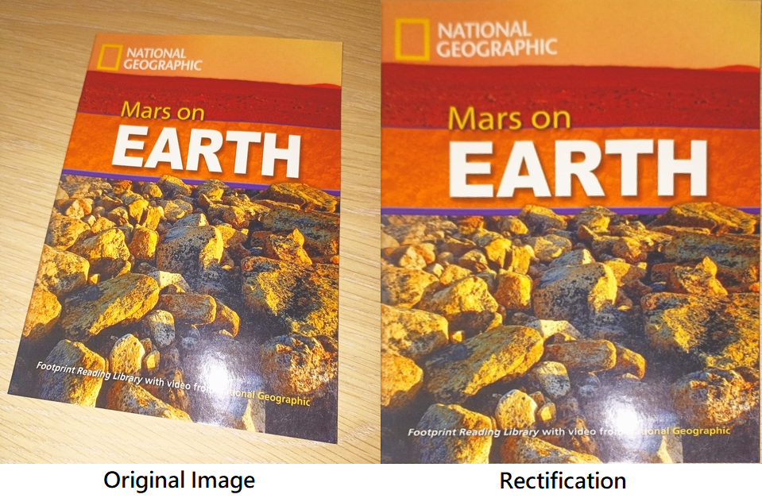

---

# Project 3: Stereo Rectification
#### Python Usage
```
python3 StereoRectification.py --img1 images/bike1.png --img2 images/bike2.png
```

#### Original images:
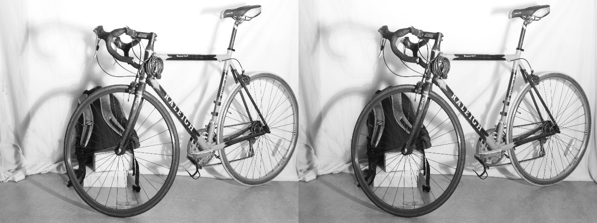
#### Epilines:
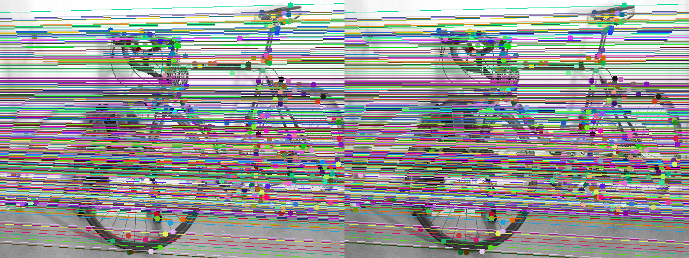
#### Stereo rectification:
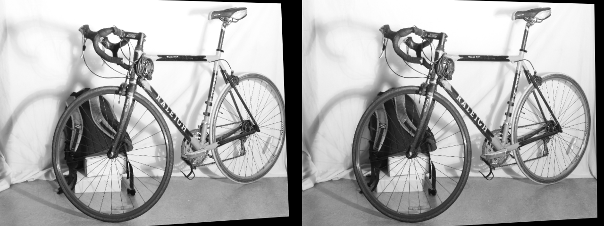

---

# Project 4: Image Stitching
#### Python Usage
```
python3 image_stitching.py --imgDir successive_images/scottsdale --outputDir results 
```
#### [Stitching Pipeline](https://docs.opencv.org/3.4/d1/d46/group__stitching.html):
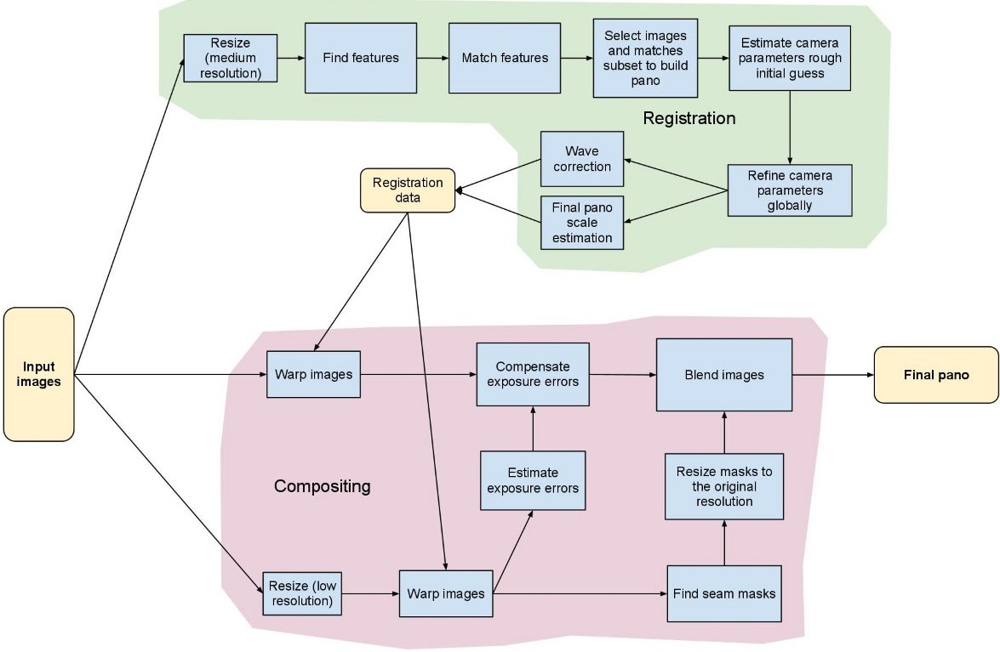

#### original three images
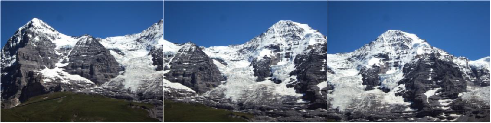

#### stitch all images
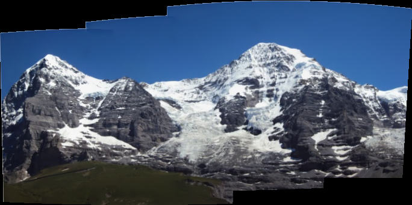

#### crop the image
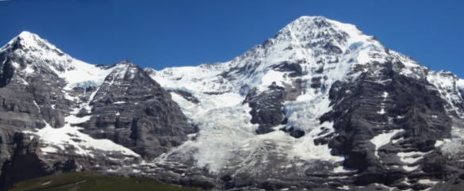

---

# Project 5: 3D Rasterizer

* Objective: To display the polygons
* Language: Python
* Library: ```pygame```
* Input: ```.obj``` files

## Usage
The parameters can be modified in ```main_displayer.py```. Then run
```
python3 main_displayer.py
```

## Controls
* Movement: ```W```, ```A```, ```S```, ```D```
* Rotation: ```←``` (left arrow) and ```→``` (right arrow)

---

# Project 6: Camera Pose Estimation

First, merge separate data inputs. 
```
python3 merge_data.py
```

After runnung `merge_data.py`, please make sure that 4 pkl files, namely `images.pkl`, `point_desc.pkl`, `points3D.pkl`, and `train.pkl`, are in the `data` directory. 

## Project 6-1: (camera pose) trajectory plot
```
python3 trajectoryPlot.py --pnp epnp_gauss
python3 trajectoryPlot.py --pnp epnp_gauss  --onlyshow 1 
```
#### Original Data (Point Clouds)
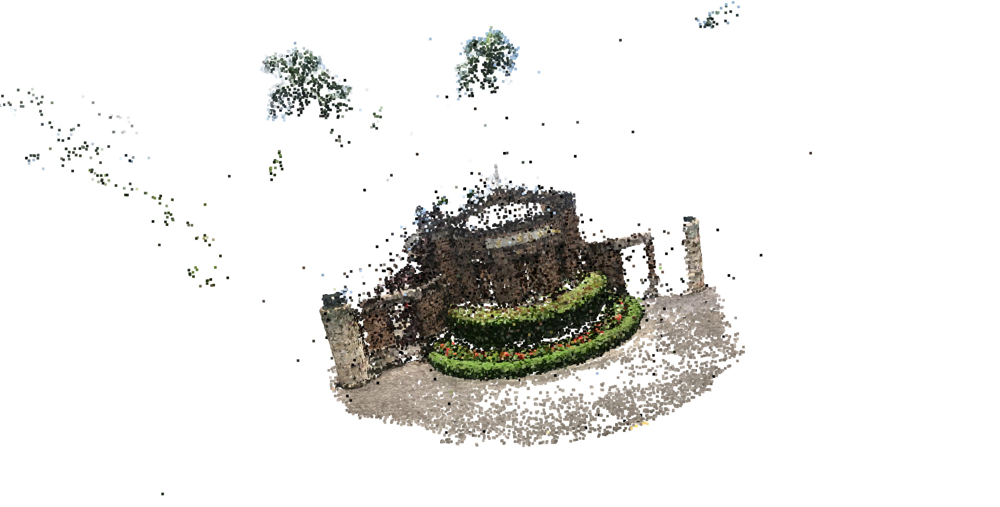

#### Moving Trajectory
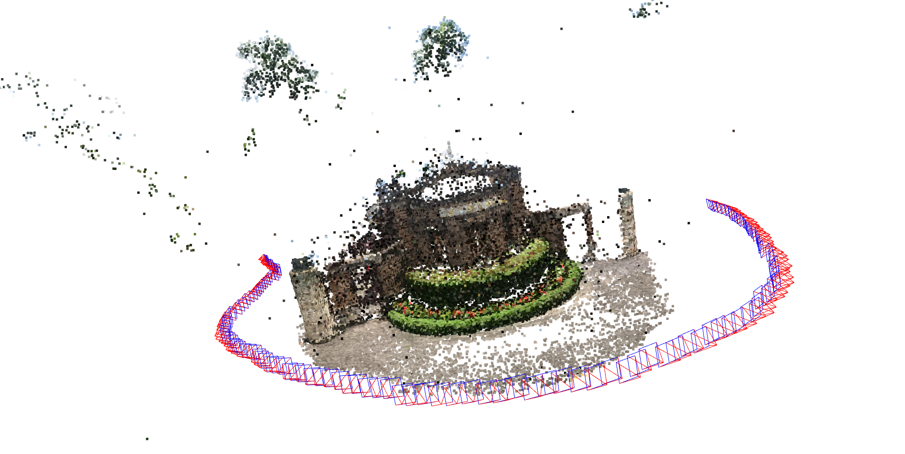

*  Options for the command-line argument `--pnp` for PnP pose computations are provided:
    * p3p_Grunert_ransac
    * normalized_DLT
    * epnp
    * epnp_gauss
    * opencv_PnPRansac

---

## Project 6-2: (camera pose) Augmented Reality (AR)
```
python3 cubeDrawing.py --pnp epnp_gauss --videopath results/cubeVideo.mp4
python3 cubeDrawing.py --pnp epnp_gauss --onlyshow 1 --videopath results/cubeVideo.mp4 
python3 cubeDrawing.py --onlyshow 2 --videopath results/cubeVideo.mp4 
```


---

# Project 7: Camera Calibration
#### Python Usage
```
python3 camera_calibration.py
```
This program estimates the camera intrinsic matrix and the distortion coefficients. 

#### Relative camera poses: 
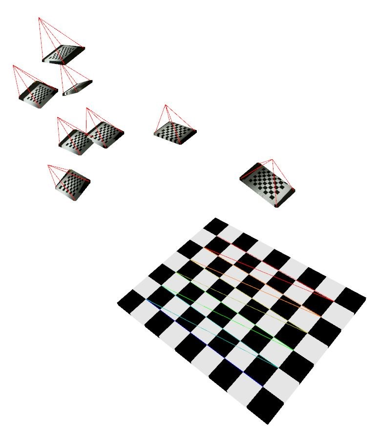

---
# Project 8: Visual Odometry
#### Python Usage
```
python3 main_vo.py --imgDir input_vo_frames --camParams results_calibration/camera_params.npy --features 1000 --trackerConfig orb --poseMethod opencv --show True
```
where the ```--trackerConfig``` has the following options: 
```
orb
brisk
sift
sift_root
akaze
LK_SHI_TOMASI
LK_FAST
```

#### The result from ```sift_root``` is shown in this YouTube link: https://youtu.be/HYALMOclFIc
[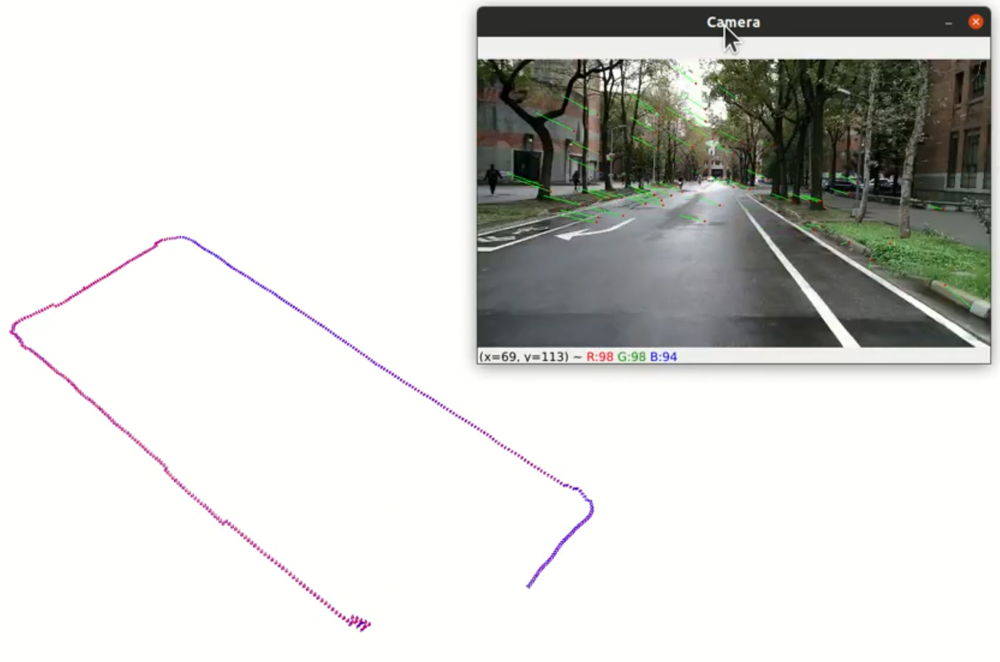](https://www.youtube.com/watch?v=HYALMOclFIc)


---

## Tools

### Estimate the pose error (for Project 5)
```
python3 poseError.py
```

### Visualize a cube by using Open3D (for Project 5-2)
```
python3 transform_cube.py
```

---

# Note
* All output files are saved in the `results` folder. 
* Some of projects are modified from the class of 3D Computer Vision with Deep Learning Applications at National Taiwan University.

---

# Resources and References
[1] Lecture Notes from Chu-Song Chen's class of 3D Computer Vision with Deep Learning Applications (Fall 2022) <br>
[2] Homography Estimation from [hughesj919's Github](https://github.com/hughesj919/HomographyEstimation/blob/master/Homography.py) <br>
[3] Inverse Warping from [makkrnic's Github](https://github.com/makkrnic/inverse-perspective-mapping/blob/master/prototype/transform.py) <br>
[4] (Project 3) [images](https://drive.google.com/drive/folders/15gBoik7dpRhlzmwqeSnyyZe9AnFKeioz)  <br>
[5] Stitching Pipeline from [OpenCV](https://docs.opencv.org/3.4/d1/d46/group__stitching.html) <br>
[6] Image Stitching from [apoorva-dave's Github](https://github.com/apoorva-dave/Image-Stitching/blob/master/image_stitching_simple.pyy)  <br>
[7] (Project 5) 3D Rasterizer from [lcox74's github](https://github.com/lcox74/Py3D)  <br>
[7] (Project 6) [Dataset](https://drive.google.com/u/0/uc?export=download&confirm=qrVw&id=1GrCpYJFc8IZM_Uiisq6e8UxwVMFvr4AJ)  <br>
[8] EPnP and Gauss-Newton Optimization from [WeiyanCai's Github](https://github.com/WeiyanCai/EPnP_Python)  <br>
[9] Direct Linear Transform (DLT) from [acvictor's Github](https://github.com/acvictor/DLT/blob/master/DLT.py)  <br>
[10] Visual Odometry from [luigifreda's github](https://github.com/luigifreda/pyslam)   <br>
[11] Pose Recovery from [laavanyebahl's github](https://github.com/laavanyebahl/3D-Reconstruction-and-Epipolar-Geometry)   <br>
[12] Absolute Orientation Problem in [Cyrill Stachniss's lecture notes](https://www.ipb.uni-bonn.de/html/teaching/photo12-2021/2021-pho2-08-absolute-orient.pptx.pdf)   <br>
